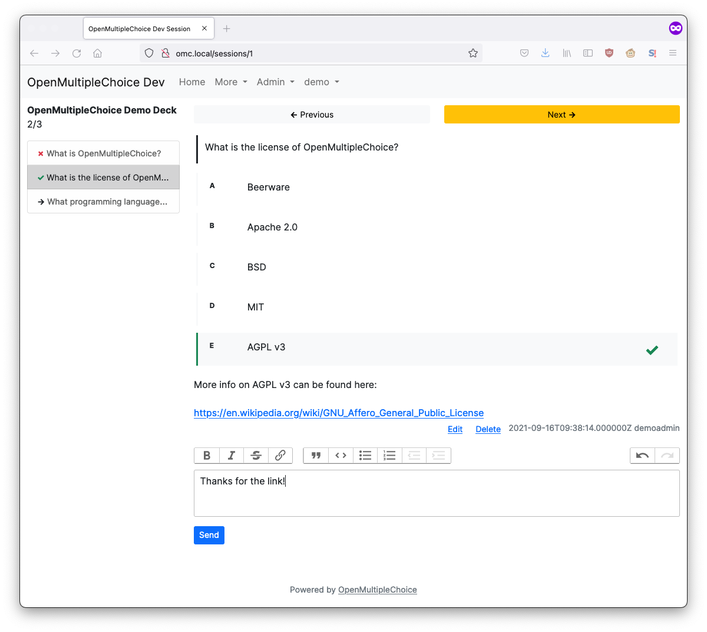

# OpenMultipleChoice


Status: alpha

OpenMultipleChoice is an **open source web application for multiple choice
question ([MCQ](https://en.wikipedia.org/wiki/Multiple_choice)) and flashcard
decks**. Built for medical students, OMC is for anyone who learns from decks of
MCQs and flashcards.



> [!NOTE]
> Please keep in mind that OpenMultipleChoice is still under active development.

For news and updates, join the Discord server or watch the repository here on
GitHub.

* Questions: [Questions & Answers](https://github.com/openmultiplechoice/openmultiplechoice/discussions/categories/q-a)
* Bug reports: [Issues](https://github.com/openmultiplechoice/openmultiplechoice/issues)
* Discord: https://discord.gg/NdvVNBN5Dh

## Documentation

* [Installation](docs/installation.md)
* [Development](docs/development.md)

## Security

For security issues, please send a private mail to the address below and do not
open an issue.

```
security@openmultiplechoice.de
```

## Contributing

Pull requests for bug fixes, code optimizations and documentation improvements
are very welcome.

Please discuss potential new features and their implementation details first.

While we appreciate all contributions, please understand that we may not be
able to merge every pull request, even those of high quality, due to project
direction, maintenance considerations, or other factors.

## Contact

For questions, bug reports, etc., please use the above-mentioned channels. For
private inquiries, the following email address can be used:

```
mail@openmultiplechoice.de
```

## License

Copyright (C) 2020 Michael Schubert and [contributors](https://github.com/openmultiplechoice/openmultiplechoice/graphs/contributors).

OpenMultipleChoice is free to use under the terms of AGPL v3:

[GNU Affero General Public License v3](https://www.gnu.org/licenses/agpl-3.0.en.html)

## Acknowledgments

* Logo font: [Luckiest Guy](https://fonts.google.com/specimen/Luckiest+Guy)
