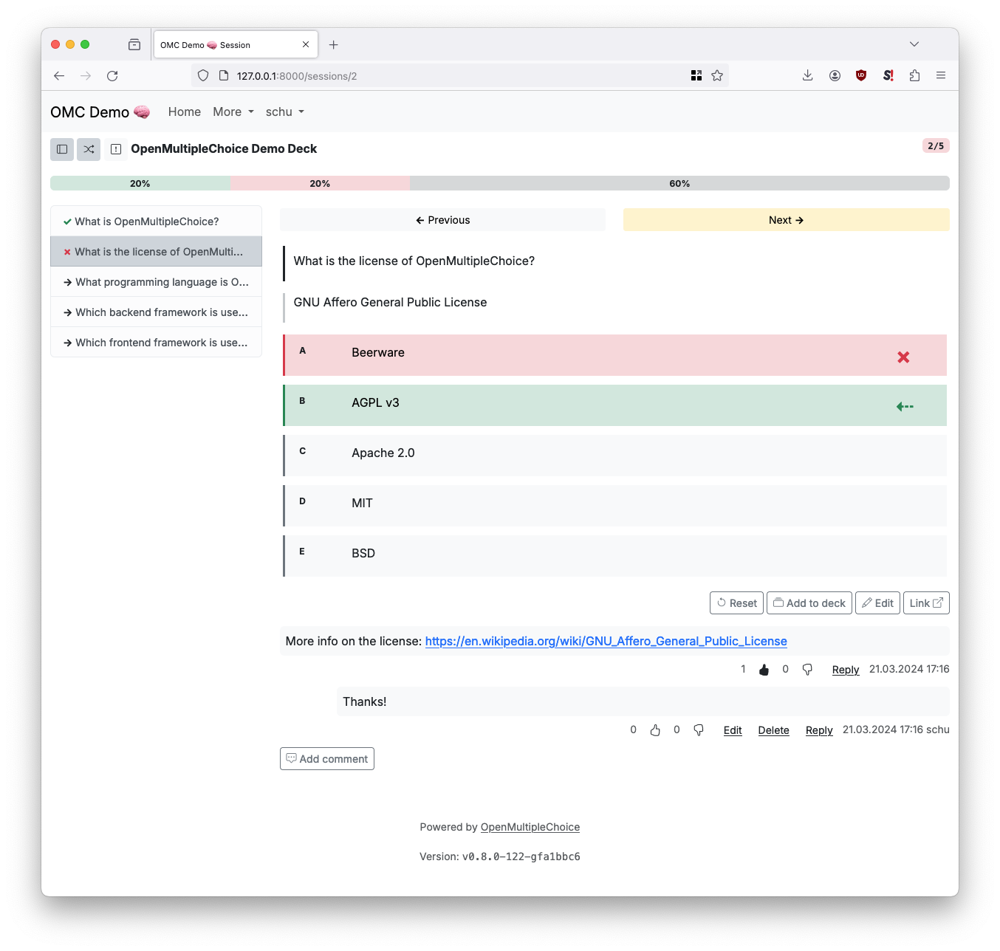

# OpenMultipleChoice

Status: experimental, work in progress

OpenMultipleChoice is an open source web application for multiple choice
([MCQ](https://en.wikipedia.org/wiki/Multiple_choice)) exam exercises.

**Please note**: OpenMultiplceChoice is **not usable yet**, currently under active
development and does not yet accept issues or pull requests. The first alpha release
is planned for Q1 2022.

For news and updates (or to signal your interest in the project), feel free to
join the Discord server or to star & watch the repository here on GitHub.

You can also send an email (German or English) to `feedback@openmultiplechoice.de`
to express your interest and to be notified for the first release.

Discord: https://discord.gg/NdvVNBN5Dh

Demo: https://demo.openmultiplechoice.de (coming soon)

## Documentation

* [Development](docs/development.md)

## License

[AGPL v3](https://www.gnu.org/licenses/agpl-3.0.en.html)

## Credits

* Logo font: [Luckiest Guy](https://fonts.google.com/specimen/Luckiest+Guy)
